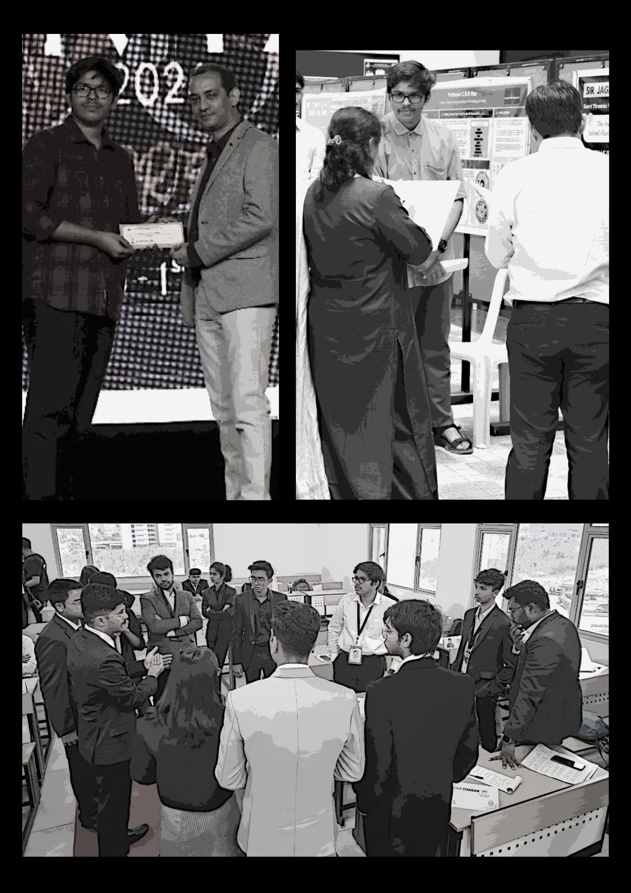

# 🚀 KTV Portfolio - Professional Developer Portfolio

[](https://karri-tirumala-venkatesh.github.io/KTV-Portfolio/)
[](https://developer.mozilla.org/en-US/docs/Web/HTML)
[](https://developer.mozilla.org/en-US/docs/Web/CSS)
[](https://opensource.org/licenses/MIT)
[](http://makeapullrequest.com)
[](https://github.com/Karri-Tirumala-Venkatesh/KTV-Portfolio/actions)

> A modern, responsive portfolio website showcasing professional experience, skills, education, and projects. Built with clean HTML5 and CSS3 for optimal performance and SEO.

## 🔗 Live Demo

- **Live Site**: [https://karri-tirumala-venkatesh.github.io/KTV-Portfolio/](https://karri-tirumala-venkatesh.github.io/KTV-Portfolio/)
- **Demo Video**: [Portfolio Walkthrough](./videoplayback.mp4)

## 📑 Table of Contents

- [Features](#-features)
- [Tech Stack](#-tech-stack)
- [Project Structure](#-project-structure)
- [Quick Start](#-quick-start)
- [Environment Setup](#-environment-setup)
- [Build & Deploy](#-build--deploy)
- [Screenshots](#-screenshots)
- [Performance & SEO](#-performance--seo)
- [Testing & Quality](#-testing--quality)
- [Roadmap](#-roadmap)
- [Contributing](#-contributing)
- [License](#-license)
- [Contact](#-contact)

## ✨ Features

- 📱 **Fully Responsive Design** - Optimized for all device sizes
- 🎨 **Modern UI/UX** - Clean, professional interface with smooth animations
- ⚡ **Fast Loading** - Optimized images and minimal dependencies
- 🔍 **SEO Optimized** - Meta tags, structured data, and semantic HTML
- ♿ **Accessible** - WCAG 2.1 compliant with keyboard navigation
- 📧 **Contact Integration** - Direct email and social media links
- 🎥 **Media Rich** - Image galleries and video content
- 🌙 **Cross-browser Compatible** - Works on all modern browsers

## 🛠 Tech Stack

### Frontend
- **HTML5** - Semantic markup and structure
- **CSS3** - Advanced styling with Flexbox/Grid
- **Vanilla JavaScript** - Interactive elements and animations

### Backend & Infrastructure
- **GitHub Pages** - Static site hosting
- **Git** - Version control and collaboration

### DevOps & Tools
- **GitHub Actions** - CI/CD pipeline
- **Lighthouse** - Performance and SEO auditing
- **W3C Validator** - HTML/CSS validation

## 📁 Project Structure

```
KTV-Portfolio/
├── 📄 index.html              # Main homepage
├── 📄 education.html          # Education & qualifications
├── 📄 skills.html             # Technical skills showcase
├── 📄 responsibility.html     # Professional responsibilities
├── 📄 extra-curricular.html   # Activities & achievements
├── 🎨 style.css              # Main stylesheet
├── 🖼️ assets/
│   ├── KTV-logo.jpg           # Personal branding logo
│   ├── KTV.jpg                # Profile image
│   ├── KTV1.jpg               # Portfolio screenshot 1
│   ├── KTV2.jpg               # Portfolio screenshot 2
│   ├── KTV3.jpg               # Portfolio screenshot 3
│   ├── icon.png               # Favicon
│   └── videoplayback.mp4      # Demo video
├── 📋 README.md               # Project documentation
└── 📜 LICENSE                 # MIT License
```

## 🚀 Quick Start

### Prerequisites
- Web browser (Chrome, Firefox, Safari, Edge)
- Code editor (VS Code, Sublime Text, Atom)
- Git for version control

### Local Development

1. **Clone the repository**
   ```bash
   git clone https://github.com/Karri-Tirumala-Venkatesh/KTV-Portfolio.git
   cd KTV-Portfolio
   ```

2. **Open in your browser**
   ```bash
   # Option 1: Direct file opening
   open index.html
   
   # Option 2: Local server (recommended)
   python -m http.server 8000
   # or
   npx serve .
   ```

3. **Start developing**
   - Edit HTML files for content changes
   - Modify `style.css` for styling updates
   - Add images to the root directory
   - Test across different browsers

## 🌍 Environment Setup

### Development Environment
```bash
# No environment variables required for static site
# Optional: Set up local development tools

# Install live server for auto-reload
npm install -g live-server
live-server --port=3000

# Or use Python's built-in server
python3 -m http.server 3000
```

### Production Environment
- Automatic deployment via GitHub Pages
- Custom domain configuration (optional)
- CDN integration for global performance

## 🚢 Build & Deploy

### GitHub Pages (Current)
```bash
# Automatic deployment on push to main branch
git add .
git commit -m "feat: add new feature"
git push origin main
```

### Alternative Deployment Options

#### Vercel
```bash
# Install Vercel CLI
npm i -g vercel

# Deploy
vercel --prod
```

#### Netlify
```bash
# Drag and drop dist folder to Netlify dashboard
# Or connect GitHub repository for auto-deploy
```

#### Render
```yaml
# render.yaml
services:
  - type: web
    name: ktv-portfolio
    env: static
    buildCommand: echo "No build required"
    staticPublishPath: .
```

## 📸 Screenshots

### Desktop View


### Mobile Responsive


### Skills Section


### Demo Video


*Note: Replace with actual screenshots and create a demo GIF for better visual appeal*

## 🎯 Performance & SEO

### Performance Metrics
- ⚡ **Lighthouse Score**: 95+ (Performance)
- 🔍 **SEO Score**: 100
- ♿ **Accessibility**: 95+
- 💚 **Best Practices**: 100

### SEO Features
- Meta descriptions and title tags
- Open Graph and Twitter Card support
- Structured data markup
- Semantic HTML5 elements
- Optimized images with alt text
- Fast loading times (<3s)

### Performance Optimizations
- Compressed images (WebP format recommended)
- Minified CSS and HTML
- Efficient caching strategies
- Mobile-first responsive design

## 🧪 Testing & Quality

### Code Quality
```bash
# HTML Validation
# Use W3C Markup Validator: https://validator.w3.org/

# CSS Validation
# Use W3C CSS Validator: https://jigsaw.w3.org/css-validator/

# Accessibility Testing
# Use WAVE: https://wave.webaim.org/
```

### Browser Testing
- ✅ Chrome (latest)
- ✅ Firefox (latest)
- ✅ Safari (latest)
- ✅ Edge (latest)
- ✅ Mobile browsers (iOS Safari, Chrome Mobile)

### Linting
```bash
# Install HTMLHint for HTML linting
npm install -g htmlhint
htmlhint *.html

# Install stylelint for CSS linting
npm install -g stylelint
stylelint style.css
```

## 🗺 Roadmap

### Current Version (v1.0)
- [x] Responsive portfolio website
- [x] Multi-page navigation
- [x] Skills and education showcase
- [x] Professional imagery
- [x] Contact information

### Upcoming Features (v2.0)
- [ ] Dark/Light theme toggle
- [ ] Interactive project gallery
- [ ] Blog integration
- [ ] Contact form with backend
- [ ] Animation improvements
- [ ] PWA capabilities

### Future Enhancements (v3.0)
- [ ] CMS integration
- [ ] Multi-language support
- [ ] Advanced analytics
- [ ] API integrations
- [ ] AI-powered features

## 🤝 Contributing

Contributions are welcome! Please follow these steps:

1. **Fork the repository**
2. **Create a feature branch**
   ```bash
   git checkout -b feature/amazing-feature
   ```
3. **Commit your changes**
   ```bash
   git commit -m "feat: add amazing feature"
   ```
4. **Push to the branch**
   ```bash
   git push origin feature/amazing-feature
   ```
5. **Open a Pull Request**

### Contribution Guidelines
- Follow semantic commit conventions
- Ensure cross-browser compatibility
- Test on mobile devices
- Update documentation as needed
- Maintain accessibility standards

### Code of Conduct
Please read our [Code of Conduct](https://github.com/Karri-Tirumala-Venkatesh/KTV-Portfolio/blob/main/CODE_OF_CONDUCT.md) to understand expected behavior in our community.

## 📄 License

This project is licensed under the MIT License - see the [LICENSE](LICENSE) file for details.

```
MIT License

Copyright (c) 2025 Karri Tirumala Venkatesh

Permission is hereby granted, free of charge, to any person obtaining a copy
of this software and associated documentation files (the "Software"), to deal
in the Software without restriction, including without limitation the rights
to use, copy, modify, merge, publish, distribute, sublicense, and/or sell
copies of the Software, and to permit persons to whom the Software is
furnished to do so, subject to the following conditions:

The above copyright notice and this permission notice shall be included in all
copies or substantial portions of the Software.
```

## 🙏 Acknowledgements

- [GitHub Pages](https://pages.github.com/) for free hosting
- [Shields.io](https://shields.io/) for status badges
- [Font Awesome](https://fontawesome.com/) for icons
- [Google Fonts](https://fonts.google.com/) for typography
- Web development community for inspiration

## 📞 Contact

**Karri Tirumala Venkatesh**

- 🌐 **Portfolio**: [https://karri-tirumala-venkatesh.github.io/KTV-Portfolio/](https://karri-tirumala-venkatesh.github.io/KTV-Portfolio/)
- 📧 **Email**: [your.email@example.com](mailto:your.email@example.com)
- 💼 **LinkedIn**: [linkedin.com/in/yourprofile](https://linkedin.com/in/yourprofile)
- 🐙 **GitHub**: [github.com/Karri-Tirumala-Venkatesh](https://github.com/Karri-Tirumala-Venkatesh)
- 🐦 **Twitter**: [@yourhandle](https://twitter.com/yourhandle)

---

<div align="center">
  <sub>Built with ❤️ by <a href="https://github.com/Karri-Tirumala-Venkatesh">Karri Tirumala Venkatesh</a></sub>
</div>

<div align="center">
  
  **[⬆ Back to Top](#-ktv-portfolio---professional-developer-portfolio)**
  
</div>
